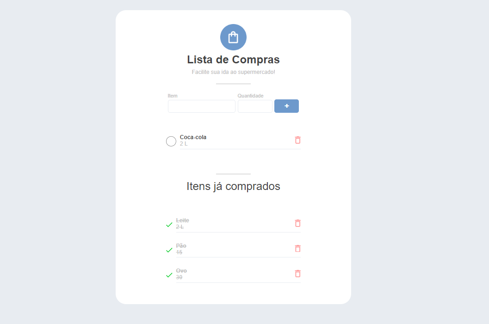

# ListaCompras
``` 
✨ Este projeto foi desenvolvido com o objetivo de aplicar meus conhecimentos 
em React, TypeScript e SCSS.
``` 



## Experiências Práticas

Inicialmente optei por utilizar um ambiente não controlado, porém fiquei curioso em relação aos inputs controlados e não controlados. Resolvi fazer uma pesquisa e após isso eu percebi que através dos inputs controlados a validação e manipulação dos dados ficam mais fáceis. No final eu mudei de ideia e fiz com inputs controlados. 
Achei o desafio bastante interessante e tranquilo. Apesar de não ter nenhum uso de API's, eu pude por em prática a criação de uma boa arquitetura de arquivos para o projeto, a criação e reutilização de componentes e também utilizei as libs do react-router-dom para poder criar uma rota de página não encontrada, uuid para definir o ID de cada item, e por fim utilizei SCSS para estilizar o projeto. 

## 🔨 Requisitos
### Formulário

Implemente a funcionalidade do formulário para que, ao submetê-lo, o item seja adicionado à lista de compras.
Você pode optar por utilizar inputs controlados ou não controlados. Pratique a abordagem com a qual você tem menos familiaridade.
Ao submeter um item, apague o formulário.
Ao submeter um item, dê o foco no primeiro input para que seja fácil escrever outro item novamente pelo usuário.

### Concluir Item

Implemente a funcionalidade de marcar um item como concluído ao clicar no botão correspondente.
Este item deverá ser movido para a lista de "Itens já comprados".
O texto do item marcado deverá ser riscado e ter uma cor mais clara.
O ícone de "A fazer" (círculo vazio) deverá ser substituído pelo ícone de "Feito" (check).

### Excluir Item

Implemente a funcionalidade de excluir um item ao clicar no ícone de lixeira.
Componentização
Organize o código em componentes e mantenha-o legível.


## 👉🏽 Sobre este mini-projeto
### O que você irá praticar:
#### React
- Componentes controlados e não controlados
- Formulários
- Estado
- Renderização condicional
- Manipulação de eventos (onClick vs onSubmit)

### Pré-requisitos
Conhecimento básico de React (JSX, componentes, props)

<a href='https://codante.io/mini-projetos/lista-de-compras-em-react'>DESAFIO [CODANTE]</a>